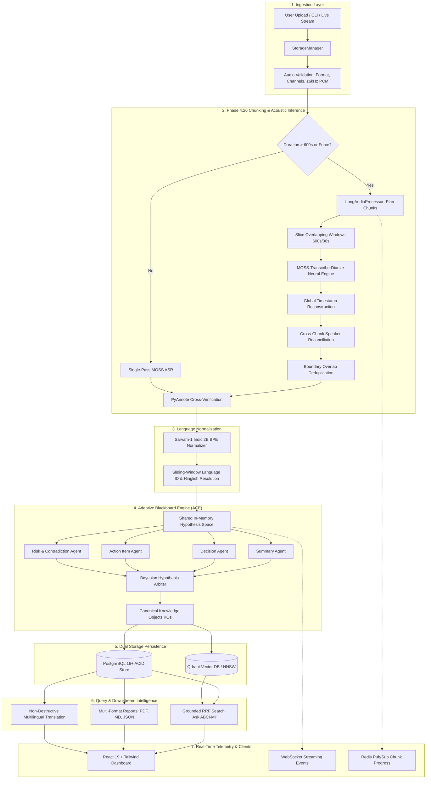
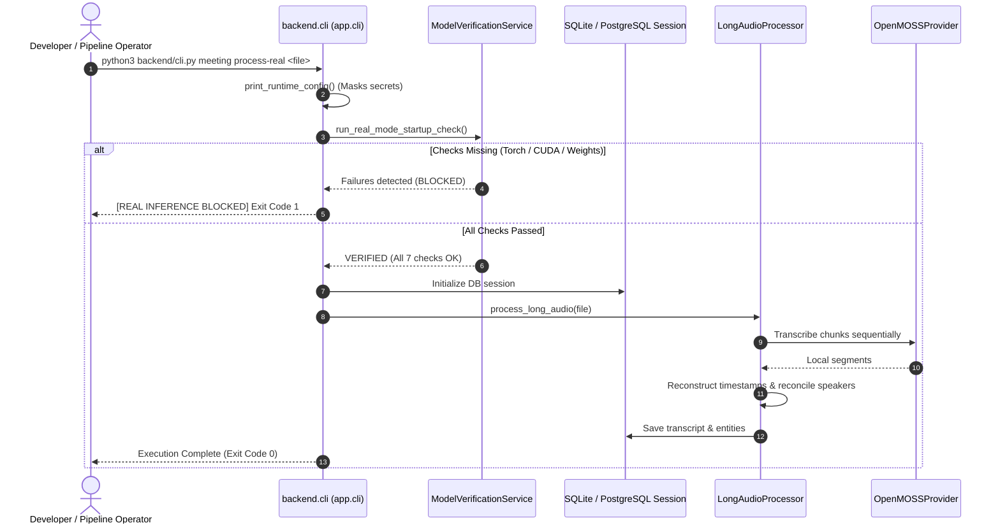
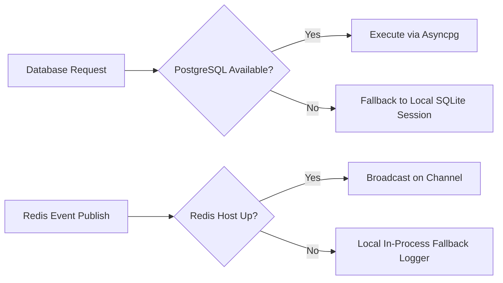

# ABCI-MI System & Data Flow Architecture (`flow.md`)

**Adaptive Blackboard & Collaboration Intelligence for Multilingual Interaction**  
*Comprehensive System Workflow, Lifecycle Diagrams, Pipeline Mechanics & State Transitions*  
*Document Version:* 2.1.0  
*Phase Coverage:* Phase 1.0 through Phase 4.26 (Real Chunked AI Pipeline & MOSS-PyAnnote Verification)

---

## Table of Contents

1. [High-Level Architectural Workflow](#1-high-level-architectural-workflow)
2. [Phase 4.26 Long-Audio Chunking Pipeline Flow](#2-phase-426-long-audio-chunking-pipeline-flow)
   - [2.1 Mathematical Chunk Window Planning](#21-mathematical-chunk-window-planning)
   - [2.2 Overlapping WAV Slicing & Storage](#22-overlapping-wav-slicing--storage)
   - [2.3 Model Inference: MOSS-Transcribe-Diarize & PyAnnote](#23-model-inference-moss-transcribe-diarize--pyannote)
   - [2.4 Global Timestamp Reconstruction](#24-global-timestamp-reconstruction)
   - [2.5 Cross-Chunk Speaker Reconciliation](#25-cross-chunk-speaker-reconciliation)
   - [2.6 Boundary-Aware Overlap Deduplication](#26-boundary-aware-overlap-deduplication)
   - [2.7 Independent PyAnnote Cross-Verification](#27-independent-pyannote-cross-verification)
   - [2.8 State Tracking, Resumption & Redis Pub/Sub](#28-state-tracking-resumption--redis-pubsub)
3. [Adaptive Blackboard & Collaboration Engine (ACE) Flow](#3-adaptive-blackboard--collaboration-engine-ace-flow)
4. [Semantic Knowledge Warehouse (SKW) & Vector Pipeline Flow](#4-semantic-knowledge-warehouse-skw--vector-pipeline-flow)
5. [Real-Time Live Streaming vs. Batch Ingestion Flow](#5-real-time-live-streaming-vs-batch-ingestion-flow)
6. [CLI & Operational Execution Flow](#6-cli--operational-execution-flow)
7. [Failure Recovery, Fallback & Security Flow](#7-failure-recovery-fallback--security-flow)

---

## 1. High-Level Architectural Workflow

The complete end-to-end data processing workflow spans seven specialized decoupled layers:



---

## 2. Phase 4.26 Long-Audio Chunking Pipeline Flow

When meeting recordings exceed the configured threshold (`AUDIO_CHUNK_THRESHOLD_SECONDS = 600.0s`), processing the entire audio stream as a monolithic file risks memory degradation, out-of-memory GPU faults, and speaker attribution drift. The **Phase 4.26 Pipeline** processes arbitrary durations (1 to 2+ hours) through seamless chunk windowing:

```
[Raw Meeting Audio (e.g. 7200s / 2 Hours)]
    │
    ▼
┌─────────────────────────────────────────────────────────────────────────────┐
│ 1. CHUNK PLANNER: Calculate Window Bounds                                   │
│    • Chunk 0: [0.0s ──► 600.0s]        (Step: 570s, Overlap: 30s)          │
│    • Chunk 1: [570.0s ──► 1170.0s]     (Overlap start: 30s, end: 30s)      │
│    • Chunk 2: [1140.0s ──► 1740.0s]    ...                                 │
│    • Chunk N: [(N*570)s ──► 7200.0s]                                        │
└──────────────────────────────────────┬──────────────────────────────────────┘
                                       │
                                       ▼
┌─────────────────────────────────────────────────────────────────────────────┐
│ 2. BINARY SLICER: Sub-Process WAV Generation                                │
│    • Extract byte ranges via wave/PCM frame offsets                         │
│    • Write standalone valid RIFF/WAVE chunks to isolated temp space         │
└──────────────────────────────────────┬──────────────────────────────────────┘
                                       │
                                       ▼
┌─────────────────────────────────────────────────────────────────────────────┐
│ 3. NEURAL INFERENCE (Serialized Concurrency = 1)                            │
│    • OpenMOSSProvider: MOSS-Transcribe-Diarize                              │
│    • Yields local chunk segments: {start, end, speaker_id, text, words}     │
└──────────────────────────────────────┬──────────────────────────────────────┘
                                       │
                                       ▼
┌─────────────────────────────────────────────────────────────────────────────┐
│ 4. GLOBAL TIMESTAMP RECONSTRUCTION                                          │
│    • t_global_start = t_local_start + chunk_metadata.start_time             │
│    • t_global_end   = t_local_end   + chunk_metadata.start_time             │
│    • Apply identically to all segment and word-level timestamps             │
└──────────────────────────────────────┬──────────────────────────────────────┘
                                       │
                                       ▼
┌─────────────────────────────────────────────────────────────────────────────┐
│ 5. CROSS-CHUNK SPEAKER RECONCILIATION                                       │
│    • Identify overlap region: [chunk_start, chunk_start + overlap_sec]      │
│    • Construct Bipartite Overlap Matrix between active and incoming turns   │
│    • Resolve global IDs: Chunk 1 'S01' ──► Global 'SPEAKER_00'             │
└──────────────────────────────────────┬──────────────────────────────────────┘
                                       │
                                       ▼
┌─────────────────────────────────────────────────────────────────────────────┐
│ 6. BOUNDARY-AWARE OVERLAP DEDUPLICATION                                     │
│    • Discard duplicate phrases within [t_overlap_start, t_overlap_end]      │
│    • String similarity matching (Normalized Levenshtein > 0.80)             │
│    • Seamless transition with zero stutter or truncated sentences           │
└──────────────────────────────────────┬──────────────────────────────────────┘
                                       │
                                       ▼
┌─────────────────────────────────────────────────────────────────────────────┐
│ 7. PYANNOTE INDEPENDENT VERIFICATION                                        │
│    • PyAnnote speaker diarization run across speech windows                 │
│    • Verify MOSS speaker tags against PyAnnote clusters                     │
│    • Detect and record SPEAKER_MISMATCH and SPEAKER_CONFLICT tags           │
└─────────────────────────────────────────────────────────────────────────────┘
```

### 2.1 Mathematical Chunk Window Planning

For total audio duration $T$, chunk window length $L_{chk}$ (default 600.0s), and overlap duration $L_{ovl}$ (default 30.0s):

1. **Step Size ($S$):**
   $$S = L_{chk} - L_{ovl} = 600.0 - 30.0 = 570.0\text{ seconds}$$

2. **Total Chunk Count ($N$):**
   $$N = \max\left(1, \left\lceil \frac{T - L_{ovl}}{S} \right\rceil\right)$$

3. **Interval Computation for Chunk $i \in [0, N-1]$:**
   $$\text{Start}_i = i \times S$$
   $$\text{End}_i = \min(T, \text{Start}_i + L_{chk})$$

4. **Overlap Boundary Metadata:**
   $$\text{OverlapStart}_i = 0.0 \quad (i = 0), \quad L_{ovl} \quad (i > 0)$$
   $$\text{OverlapEnd}_i = L_{ovl} \quad (i < N - 1), \quad 0.0 \quad (i = N - 1)$$

### 2.2 Overlapping WAV Slicing & Storage

- The slicer parses standard RIFF/WAVE headers using sample rate $R$ (16,000 Hz) and sample width $W$ (2 bytes for 16-bit PCM).
- Exact frame seek index:
  $$\text{FrameStart}_i = \lfloor \text{Start}_i \times R \rfloor$$
  $$\text{FrameCount}_i = \lfloor (\text{End}_i - \text{Start}_i) \times R \rfloor$$
- Slices are saved as temporary independent PCM files with intact 44-byte RIFF headers, guaranteeing compatibility with downstream decoders.

### 2.3 Model Inference: MOSS-Transcribe-Diarize & PyAnnote

- In `EXECUTION_MODE=REAL`, `OpenMOSSProvider` loads `OpenMOSS-Team/MOSS-Transcribe-Diarize` on `OPENMOSS_DEVICE=cuda`.
- Concurrency is throttled to `AUDIO_CHUNK_CONCURRENCY = 1` to prevent GPU Out-of-Memory (OOM) conditions.
- If dependencies or hardware are unavailable, execution halts with an explicit error rather than silently degrading.

### 2.4 Global Timestamp Reconstruction

Local timestamps emitted by MOSS for Chunk $i$ are bounded between $[0.0, \text{duration}_i]$. The reconstruction engine remaps every segment and constituent word token:

$$t_{\text{global\_start}} = t_{\text{local\_start}} + \text{Start}_i$$
$$t_{\text{global\_end}} = t_{\text{local\_end}} + \text{Start}_i$$

Word-level timestamps maintain relative sub-second offsets for high-precision search and dynamic text-to-speech synchronization.

### 2.5 Cross-Chunk Speaker Reconciliation

Speaker labels generated per chunk (`S01`, `S02`, etc.) do not naturally persist identity across distinct inference windows. ABCI-MI reconciles speakers using a temporal overlap graph:

```
Chunk 0: [570.0s ═══════════ S01 (Speaking) ═══════════ 600.0s]
                               │ Identical acoustic interval
Chunk 1: [570.0s ═══════════ S02 (Speaking) ═══════════ 600.0s]
                               │
               Hungarian Bipartite Mapping
                               ▼
            S01 (Chunk 0) ≡ S02 (Chunk 1) ──► SPEAKER_00
```

1. Identify temporal intersection $[I_{start}, I_{end}] = [\text{Start}_i, \text{Start}_i + L_{ovl}]$.
2. Calculate intersection-over-union (IoU) of speaker active time intervals:
   $$\text{IoU}(S_a, S_b) = \frac{\text{Duration}(S_a \cap S_b)}{\text{Duration}(S_a \cup S_b)}$$
3. Assign local speaker $S_b$ to existing global speaker $G_k$ if $\text{IoU} > 0.40$. Otherwise, allocate next global speaker ID $G_{k+1}$.

### 2.6 Boundary-Aware Overlap Deduplication

Because the 30-second window is transcribed twice (once at the end of Chunk $i$ and once at the beginning of Chunk $i+1$), duplicate sentences must be removed:

1. Extract segments from Chunk $i$ where $t_{end} > \text{Start}_{i+1}$.
2. Extract segments from Chunk $i+1$ where $t_{start} < \text{End}_i$.
3. Compute normalized Levenshtein string similarity:
   $$\text{Sim}(T_1, T_2) = 1.0 - \frac{\text{Levenshtein}(T_1, T_2)}{\max(|T_1|, |T_2|)}$$
4. If $\text{Sim} \ge 0.80$, retain Chunk $i$'s segment and discard the redundant duplicate in Chunk $i+1$.

### 2.7 Independent PyAnnote Cross-Verification

PyAnnote runs as an independent verification model across speech intervals:
- **`SPEAKER_MATCH`**: MOSS speaker cluster aligns with PyAnnote turn clustering.
- **`SPEAKER_MISMATCH`**: PyAnnote attributes turn to a different speaker label with confidence $> 0.85$.
- **`SPEAKER_CONFLICT`**: Two distinct MOSS speakers map to the same continuous PyAnnote voiceprint.
- Discrepancies are logged in the verification report without discarding transcription text.

### 2.8 State Tracking, Resumption & Redis Pub/Sub

```
Chunk State Machine:
  [PENDING] ──► [PROCESSING] ──► [COMPLETED]
                     │
                     └──► [FAILED] ──► [RETRY / RESUME]
```

- State is serialized to the database after each chunk settles.
- Real-time progress events are broadcast over Redis channel:
  `events:meetings:{meeting_id}:chunks`
  ```json
  {
    "event": "chunk_completed",
    "meeting_id": "...",
    "chunk_index": 2,
    "total_chunks": 12,
    "progress_percent": 25.0
  }
  ```

---

## 3. Adaptive Blackboard & Collaboration Engine (ACE) Flow

```
┌─────────────────────────────────────────────────────────────────────────────┐
│                      SHARED IN-MEMORY HYPOTHESIS SPACE                      │
│                                                                             │
│  [Hypothesis: Action Item #1]    [Hypothesis: Key Decision #1]              │
│  • Proposer: ActionItemAgent     • Proposer: DecisionAgent                  │
│  • Evidence: Segment 42, 43      • Evidence: Segment 12, 14                 │
│  • Weight: 0.82                  • Weight: 0.94                             │
│                                                                             │
│  [Hypothesis: Contradiction #1]  [Hypothesis: Risk #1]                      │
│  • Proposer: RiskAgent           • Proposer: RiskAgent                      │
│  • Status: Active Evaluation     • Weight: 0.76                             │
└──────────────────────────────────────┬──────────────────────────────────────┘
                                       │
                         Weighted Bayesian Arbiter
                                       │
                                       ▼
┌─────────────────────────────────────────────────────────────────────────────┐
│                   CANONICAL KNOWLEDGE OBJECTS (KOs)                         │
│  • Promoted Facts (Confidence >= 0.85)                                      │
│  • Immutable Versioning, Lineage & Citation Anchors                         │
└─────────────────────────────────────────────────────────────────────────────┘
```

1. **Normalized Turns Arrival**: Sarvam-1 normalizer deposits clean text turns into the blackboard working memory.
2. **Agent Activation**: Specialized Knowledge Source (KS) agents trigger concurrently:
   - **Summary Agent**: Progressive hierarchical abstraction.
   - **Decision Agent**: Extracts explicit agreements, motions, and consensus.
   - **Action Item Agent**: Extracts assignees, deadlines, and deliverables.
   - **Risk & Contradiction Agent**: Identifies conflicting commitments or operational risks.
3. **Bayesian Arbitration**: The Arbiter computes composite confidence scores. Hypotheses exceeding the confidence threshold ($C \ge 0.85$) are promoted to Canonical Knowledge Objects (KOs).

---

## 4. Semantic Knowledge Warehouse (SKW) & Vector Pipeline Flow

```
Knowledge Object (KO)
    │
    ▼
[text-embedding-004 / bge-m3] (768 or 1024-dim dense vector)
    │
    ▼
[Qdrant Collection: 'abcimi_knowledge_warehouse']
    │
    ├── HNSW Index (Cosine Distance, ef_search = 128)
    └── Payload: {tenant_id, meeting_id, object_type, confidence, timestamp}
    │
    ▼
Hybrid Retrieval Engine ("Ask ABCI-MI")
    │
    ├── 1. Dense Vector KNN Search (Semantic Affinity)
    ├── 2. PostgreSQL Full-Text Search (Exact Keyword Match)
    │
    ▼
Reciprocal Rank Fusion (RRF):
    RRF_Score(d) = Σ [ 1 / (60 + Rank_dense(d)) + 1 / (60 + Rank_sparse(d)) ]
    │
    ▼
Ranked Citations & LLM Synthesis with Grounded Verification
```

---

## 5. Real-Time Live Streaming vs. Batch Ingestion Flow

| Characteristic | Live Streaming Pipeline | Batch Chunked Pipeline |
| :--- | :--- | :--- |
| **Input Format** | Opus/WebM audio frames over WebSocket | Multipart file upload (`.wav`, `.mp3`, `.mp4`) |
| **Latency Target** | Sub-second partials (< 800ms) | Deep offline processing (RTF < 0.5x) |
| **Processing Unit** | 2-second streaming audio frames | 600-second overlapping audio chunks |
| **Diarization** | Fast online clustering | High-precision MOSS + PyAnnote offline verification |
| **State Persistence** | Ephemeral Redis cache + checkpoint flush | PostgreSQL transactional commits per chunk |
| **Client UI** | Live scrolling transcript + real-time alerts | Interactive meeting dashboard + downloadable reports |

---

## 6. CLI & Operational Execution Flow

The CLI (`backend.cli` / `app.cli`) serves as a developer interface and automated testing tool:



### CLI Commands Reference

```bash
# 1. Run explicit 7-point REAL-mode startup check
python3 backend/cli.py meeting check-real-mode

# 2. Process real audio recording with strict REAL inference
python3 backend/cli.py meeting process-real ./data/audio/raw/meeting.wav

# 3. Process meeting audio and export PDF report
python3 backend/cli.py --file ./data/audio.mp3 --title "Exec Sync" --export-format pdf

# 4. Ask questions against processed meeting
python3 backend/cli.py --meeting-id <UUID> --query "What were the key decisions?"

# 5. Interactive terminal inspection mode
python3 backend/cli.py --interactive
```

---

## 7. Failure Recovery, Fallback & Security Flow

### Zero-Silent-Fallback Enforcement

In strict compliance with architectural directives:
- When `EXECUTION_MODE=REAL`, if PyTorch, CUDA, MOSS weights, or PyAnnote are missing, the pipeline **strictly halts** and raises `RuntimeError`.
- It **never** silently substitutes mock text, fixture transcripts, or falls back to CPU without operator approval.

### Database & Network Connection Resilience



### Secret Management & Zero-Hardcoding Flow

- All API keys (`GEMINI_API_KEY`, `HF_TOKEN`, database passwords) are injected exclusively via runtime environment variables or Google Cloud Secret Manager.
- All credential patterns are blocked from source control via `.gitignore`.
- Error sanitization routines strip tokens, connection strings, and passwords before errors bubble up to CLI logs or UI notifications.
